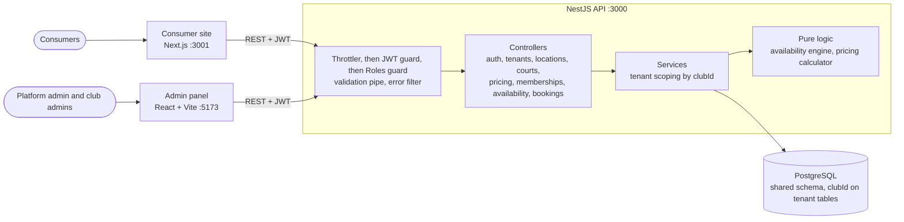

# Architecture

## Request flow
1. The client sends `Authorization: Bearer <access token>`.
2. Guards authenticate (user and club loaded from the DB, so deactivation applies immediately) and check the role.
3. A controller passes `clubId` from the token to the service; DTOs are validated first.
4. Services filter every query by `clubId`; bookings run in a transaction with a court row lock, backed by an exclusion constraint.