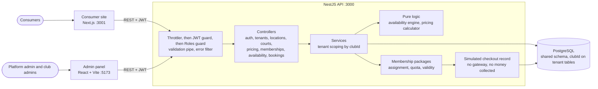

# Architecture

## Membership package flow

1. A Club Admin creates package options for a membership: validity, booking
   duration, number of included bookings, and rate per booking. The backend
   calculates the displayed package fee as `rate × included bookings`.
2. The Club Admin assigns an option to a consumer registered in that club
   context. A consumer has one current assignment per club. A renewal can be
   assigned with five or fewer days remaining; it starts after the current
   package ends and receives a fresh quota.
3. The consumer confirms the demo checkout. The API records a
   `SIMULATED_PAID` receipt, but does not call a payment provider or collect
   money. The assignment becomes eligible for booking only after confirmation.
4. A valid membership booking consumes one package credit. Cancelling more
   than 30 minutes before start restores that credit; cancellation inside the
   30-minute window is rejected.

Shift-based bookings retain their demo booking flow and can print a booking
receipt. These receipts do not represent a collected payment.

## Request flow
1. The client sends `Authorization: Bearer <access token>`.
2. Guards authenticate (user and club loaded from the DB, so deactivation applies immediately) and check the role.
3. A controller passes `clubId` from the token to the service; DTOs are validated first.
4. Services filter every query by `clubId`; bookings run in a transaction with a court row lock, backed by an exclusion constraint.
