# Database design (PostgreSQL)

## Entity relationship diagram

```mermaid
erDiagram
    tenants ||--o{ users : "club"
    tenants ||--o{ locations : "club"
    locations ||--o{ location_opening_hours : has
    locations ||--o{ location_unavailable_periods : has
    locations ||--o{ courts : has
    courts ||--o{ court_opening_hours : "custom hours"
    locations ||--o{ pricing_shifts : has
    courts ||--o{ court_prices : has
    pricing_shifts |o--o{ court_prices : "NULL shift means Normal price"
    memberships ||--o{ membership_prices : has
    memberships ||--o{ membership_packages : offers
    users ||--o{ user_memberships : holds
    memberships ||--o{ user_memberships : plan
    membership_packages |o--o{ user_memberships : assigned
    user_memberships ||--o| membership_payments : receipt
    user_memberships |o--o{ bookings : consumes
    users ||--o{ membership_payments : has
    users ||--o{ bookings : makes
    courts ||--o{ bookings : "booked court"
    locations ||--o{ bookings : "at"

    tenants {
        uuid id PK
        string name
        string slug UK
        enum pricingModel "SHIFT_BASED or MEMBERSHIP_BASED; immutable application rule"
        boolean isActive
        string timezone
        timestamp createdAt
        timestamp updatedAt
    }
    users {
        uuid id PK
        uuid clubId FK "NULL for PLATFORM_ADMIN"
        string name
        string email "unique per club"
        string passwordHash "bcrypt"
        enum role "PLATFORM_ADMIN, CLUB_ADMIN, CONSUMER"
        boolean isActive
        string refreshTokenHash "SHA-256"
        timestamp createdAt
        timestamp updatedAt
    }
    locations {
        uuid id PK
        uuid clubId FK
        string name "unique per club while not soft-deleted"
        string address
        text details "nullable"
        integer_array durations "allowed booking minutes"
        boolean isActive
        timestamp createdAt
        timestamp updatedAt
        timestamp deletedAt "soft delete"
    }
    location_opening_hours {
        uuid id PK
        uuid clubId "tenant key"
        uuid locationId FK
        smallint dayOfWeek "0=Sunday through 6=Saturday"
        smallint startMinute "minutes after midnight"
        smallint endMinute "minutes after midnight; 1440=end of day"
    }
    location_unavailable_periods {
        uuid id PK
        uuid clubId "tenant key"
        uuid locationId FK
        date date
        smallint startMinute
        smallint endMinute
        string reason "nullable"
        timestamp createdAt
    }
    courts {
        uuid id PK
        uuid clubId "tenant key"
        uuid locationId FK
        string name "unique per location while not soft-deleted"
        text description "nullable"
        integer_array durations "NULL means all location durations"
        boolean useCustomHours
        boolean isActive
        timestamp createdAt
        timestamp updatedAt
        timestamp deletedAt "soft delete"
    }
    court_opening_hours {
        uuid id PK
        uuid clubId "tenant key"
        uuid courtId FK
        smallint dayOfWeek "0=Sunday through 6=Saturday"
        smallint startMinute
        smallint endMinute
    }
    pricing_shifts {
        uuid id PK
        uuid clubId "tenant key"
        uuid locationId FK
        string name "unique per location"
        smallint startMinute
        smallint endMinute
        timestamp createdAt
        timestamp updatedAt
    }
    court_prices {
        uuid id PK
        uuid clubId "tenant key"
        uuid courtId FK
        uuid shiftId FK "NULL means Normal price"
        integer durationMinutes
        numeric price
    }
    memberships {
        uuid id PK
        uuid clubId "tenant key"
        string name "unique per club while not soft-deleted"
        text description "nullable"
        integer validityDays
        boolean isActive
        timestamp createdAt
        timestamp updatedAt
        timestamp deletedAt "soft delete"
    }
    membership_prices {
        uuid id PK
        uuid clubId "tenant key"
        uuid membershipId FK
        integer durationMinutes
        numeric price
    }
    membership_packages {
        uuid id PK
        uuid clubId "tenant key"
        uuid membershipId FK
        integer validityDays
        integer bookingDurationMinutes
        integer includedBookings
        numeric pricePerBooking
        boolean isActive
        timestamp createdAt
        timestamp updatedAt
    }
    user_memberships {
        uuid id PK
        uuid clubId "tenant key"
        uuid userId FK
        uuid membershipId FK
        uuid packageId FK "nullable for legacy assignments"
        numeric packageFee "nullable assignment-time snapshot"
        timestamp paidAt "NULL until demo checkout confirmation"
        timestamp startsAt
        timestamp expiresAt
        timestamp cancelledAt "nullable"
        timestamp createdAt
    }
    membership_payments {
        uuid id PK
        uuid clubId "tenant key"
        uuid userId FK
        uuid userMembershipId FK, UK
        numeric amount
        string status "PENDING or SIMULATED_PAID"
        string method "DEMO or NULL"
        timestamp paidAt "nullable"
        timestamp createdAt
        timestamp updatedAt
    }
    bookings {
        uuid id PK
        uuid clubId "tenant key"
        uuid locationId FK
        uuid courtId FK
        uuid userId FK
        uuid userMembershipId FK "nullable for non-membership bookings"
        date date "club timezone"
        smallint startMinute
        smallint endMinute
        integer durationMinutes
        numeric price "booking-time snapshot"
        enum pricingModel "SHIFT_BASED or MEMBERSHIP_BASED"
        uuid membershipId "nullable pricing snapshot; not an FK"
        string membershipName "nullable pricing snapshot"
        enum status "CONFIRMED or CANCELLED"
        timestamp cancelledAt "nullable"
        timestamp createdAt
    }
```

## Tenant isolation strategy

- One shared PostgreSQL database. Each tenant-owned table has a `clubId` column.
- `users.clubId` and `locations.clubId` have foreign keys to `tenants`. Most other `clubId` columns are denormalized tenant keys; their parent foreign keys are shown in the diagram.
- `clubId` is resolved from the authenticated user's club context, never accepted as a trusted request value. Service queries scope records by that value.
- Unique constraints are club-scoped where applicable. For example, consumer/admin email addresses may repeat across clubs, and location names may repeat after a soft-deleted location is removed from active use.

## Important indexes and constraints

| Table | Index / constraint | Purpose |
|---|---|---|
| users | UNIQUE (`clubId`, `email`) | Keep an email unique within a club. PostgreSQL permits multiple `NULL` club IDs, so platform-admin uniqueness is enforced by application logic if required. |
| locations | UNIQUE (`clubId`, `name`) WHERE `deletedAt IS NULL` | Allow name reuse after soft deletion. |
| courts | UNIQUE (`clubId`, `locationId`, `name`) WHERE `deletedAt IS NULL` | Allow court-name reuse after soft deletion. |
| location_opening_hours, court_opening_hours | INDEX (`clubId`, parent ID, `dayOfWeek`); CHECK weekday 0–6 and `0 <= startMinute < endMinute <= 1440` | Fast weekly schedule lookup and valid time ranges. |
| location_unavailable_periods | INDEX (`clubId`, `locationId`, `date`); CHECK valid time range | Find closures for a location and date. |
| pricing_shifts | UNIQUE (`clubId`, `locationId`, `name`); CHECK valid time range | Prevent duplicate shift names at a location and invalid ranges. |
| court_prices | UNIQUE (`courtId`, `durationMinutes`, `shiftId`) WHERE `shiftId IS NOT NULL`; UNIQUE (`courtId`, `durationMinutes`) WHERE `shiftId IS NULL`; INDEX (`clubId`, `courtId`); CHECK price >= 0 and duration > 0 | Enforce one price per duration and shift, including the Normal price where `shiftId` is NULL. |
| memberships | UNIQUE (`clubId`, `name`) WHERE `deletedAt IS NULL`; CHECK `validityDays > 0` | Preserve history while allowing a soft-deleted name to be reused. |
| membership_prices | UNIQUE (`membershipId`, `durationMinutes`); INDEX (`clubId`, `membershipId`); CHECK price >= 0 and duration > 0 | Store at most one legacy price per membership duration. |
| membership_packages | UNIQUE (`membershipId`, `validityDays`, `bookingDurationMinutes`) WHERE `isActive = true`; INDEX (`clubId`, `membershipId`); CHECK positive validity, duration, and quota, and nonnegative rate | Keep one assignable package shape active while retaining deactivated offers and their assignment history. |
| user_memberships | INDEX (`clubId`, `userId`); INDEX (`clubId`, `membershipId`); INDEX (`packageId`); CHECK `expiresAt > startsAt` and nullable package fee >= 0 | Find member assignments and preserve the package used for each assignment. |
| membership_payments | UNIQUE (`userMembershipId`); INDEX (`clubId`, `userId`, `createdAt`); CHECK nonnegative amount and consistent demo-payment state | Keep one receipt per assignment and support member payment history. |
| bookings | EXCLUDE USING GiST (`courtId`, `date`, `int4range(startMinute, endMinute)`) WHERE `status = 'CONFIRMED'`; CHECK valid range, duration matches range, and price >= 0 | Reject overlapping confirmed bookings in the database and enforce valid booking snapshots. |
| bookings | Partial INDEX (`courtId`, `date`) WHERE `status = 'CONFIRMED'`; INDEX (`clubId`, `locationId`, `date`); INDEX (`clubId`, `userId`, `date`); INDEX (`userMembershipId`) | Support availability, club booking views, consumer history, and membership quota counting. |

The single migration source currently keeps the historical migration classes in sequence in `backend/src/database/migrations/1791442532556-InitialSchema.ts`; the ERD describes the resulting schema after all of those migrations have run.
